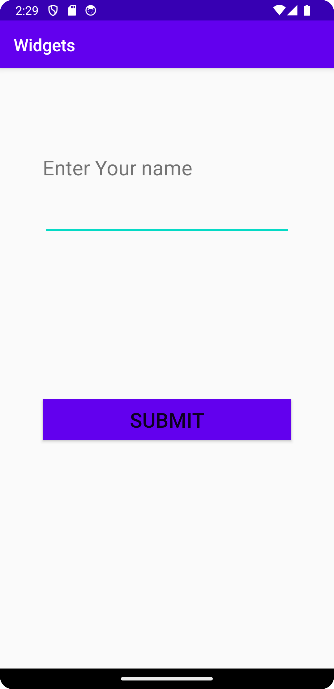

# Rapport

I denna uppgift mest av koden som ändrades ligger på activity_main.xml filen. Och där lärde jag mig att lägga in olika 
layouts, och widgets och hur man justerar dem med kod.Tex. hur texten ändras,
hur färgen och margin kan justeras på olika sätt som visas i koden i snippet som följar.

```
<?xml version="1.0" encoding="utf-8"?>
<LinearLayout xmlns:app="http://schemas.android.com/apk/res-auto"
    xmlns:tools="http://schemas.android.com/tools"
    xmlns:android="http://schemas.android.com/apk/res/android"
    android:layout_width="match_parent"
    android:layout_height="match_parent"
    android:orientation="vertical"
    tools:context=".MainActivity">

    <TextView
        android:layout_width="wrap_content"
        android:layout_height="wrap_content"
        android:layout_marginHorizontal="50dp"
        android:layout_marginBottom="10dp"
        android:layout_marginTop="100dp"
        android:text="Enter Your name"
        android:textSize="24sp" />

    <EditText
        android:id="@+id/editTextText"
        android:layout_width="match_parent"
        android:layout_height="wrap_content"
        android:layout_marginTop="10dp"
        android:layout_marginBottom="140dp"

        android:layout_marginHorizontal="50dp"
        android:ems="15"
        android:inputType="text"
        android:text="" />

    <Button
        android:id="@+id/button"
        android:layout_width="match_parent"
        android:layout_height="wrap_content"
        android:layout_margin="50dp"
        android:background="@color/colorPrimary"
        android:textSize="24sp"
        android:text="Submit" />

</LinearLayout>
```

Bilder:

